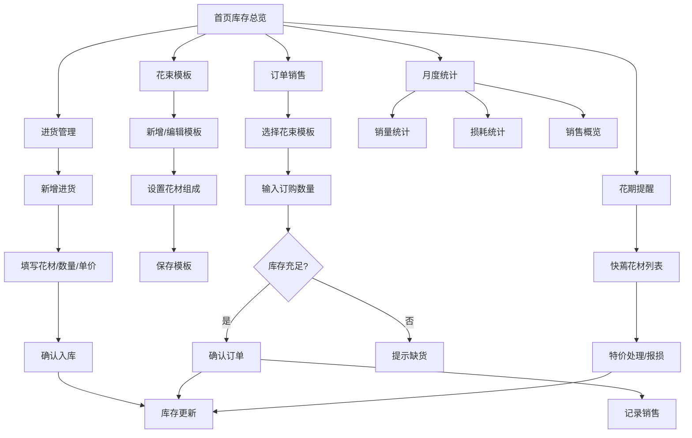

## 1. 产品概述

花小筑 - 小型花店进销存管理工具，帮助花店老板轻松管理花材进货、花束搭配、库存预警和销售统计。

- 主要用途：记录花材进货、管理花束模板、自动扣减库存、花期提醒特价、月度销售与损耗统计
- 目标用户：小型花店店主及店员
- 产品价值：降低人工记账成本，减少鲜花损耗，提升经营效率

## 2. 核心功能

### 2.1 用户角色

| 角色 | 登录方式 | 核心权限 |
|------|----------|----------|
| 店主/店员 | 无需登录，本地使用 | 全部功能：进货、销售、模板管理、统计 |

### 2.2 功能模块

1. **库存总览**：首页展示各类花材库存、预警提醒、快速操作入口
2. **进货管理**：记录花材进货（种类、数量、单价、进货日期）
3. **花束模板**：预设花束搭配方案，自定义花材组成和数量
4. **订单销售**：选择花束模板接单，自动扣减库存并记录销售
5. **花期提醒**：显示各批次花材剩余保鲜天数，临近枯萎提醒特价
6. **月度统计**：销量排行、损耗统计、销售额汇总

### 2.3 页面详情

| 页面名称 | 模块名称 | 功能描述 |
|----------|----------|----------|
| 库存总览 | 库存卡片 | 展示4种花材当前库存数量，低于安全库存标红预警 |
| 库存总览 | 花期提醒 | 列出快蔫的花材批次，显示剩余天数，一键标记特价 |
| 库存总览 | 快捷操作 | 快速进货、快速接单的入口按钮 |
| 进货管理 | 进货列表 | 按日期展示历史进货记录，可筛选花材种类 |
| 进货管理 | 新增进货 | 表单录入：选择花材、输入数量（支）、单价（元/扎）、进货日期 |
| 花束模板 | 模板列表 | 展示所有花束模板卡片，显示名称、花材组成、参考价格 |
| 花束模板 | 新增/编辑模板 | 设置模板名称、添加多种花材及数量、设置售价 |
| 订单销售 | 接单表单 | 选择花束模板、输入数量、客户信息，自动计算总价和所需花材 |
| 订单销售 | 库存校验 | 提交前检查库存是否充足，不足时提示不能接单 |
| 订单销售 | 订单列表 | 历史订单记录，可查看详情或撤销（恢复库存） |
| 月度统计 | 销量排行 | 按花材统计当月销售数量，柱状图展示 |
| 月度统计 | 损耗统计 | 按花材统计当月损耗数量和金额，饼图展示 |
| 月度统计 | 销售概览 | 当月总销售额、总订单数、平均客单价 |

## 3. 核心流程

### 3.1 进货流程
店主收到新花材 → 进入进货管理 → 选择花材种类 → 输入数量和单价 → 确认入库 → 库存增加

### 3.2 接单流程
客户订花 → 选择花束模板 → 输入订购数量 → 系统校验库存 → 库存充足则确认订单 → 扣减库存并记录销售
→ 库存不足则提示缺货，无法接单

### 3.3 花期管理
系统自动计算每批花材剩余天数 → 首页显示快蔫花材 → 店主决定特价处理或报损 → 标记后库存减少（报损）或价格调整（特价）

### 3.4 月度统计
进入统计页面 → 选择月份 → 系统汇总当月销售、进货、损耗数据 → 生成图表和排行榜

## 4. 用户界面设计

### 4.1 设计风格

**风格定位：柔和自然 · 清新雅致**

- **主色调**：豆沙粉 `#D4A5A5`（温暖优雅，呼应花店氛围）
- **辅助色**：鼠尾草绿 `#9CAF88`（自然清新，代表生机）
- **点缀色**：奶油黄 `#F5E6D3`（柔和温暖）
- **背景色**：米白 `#FDF8F5`（干净舒适）
- **文字色**：深棕灰 `#4A4A4A`（柔和不刺眼）

**按钮风格**：
- 主按钮：圆角矩形（12px），豆沙粉填充，悬停变深
- 次按钮：圆角边框，透明背景，鼠尾草绿描边
- 危险操作：浅红背景，红棕文字

**字体**：
- 标题：「思源宋体」或「Noto Serif SC」，优雅有温度
- 正文：「思源黑体」或「Noto Sans SC」，清晰易读
- 数字：等宽字体，便于对比

**布局风格**：
- 卡片式布局，柔和阴影
- 大量留白，呼吸感强
- 顶部导航栏 + 左侧菜单（桌面端）
- 移动端：底部 Tab 导航

**图标风格**：
- 线性图标，柔和圆角
- 搭配花卉元素装饰
- 使用 emoji 增添亲切感（🌹 🌸 🌼 🌷）

### 4.2 页面设计概览

| 页面名称 | 模块名称 | UI 元素 |
|----------|----------|---------|
| 库存总览 | 库存卡片 | 4张并排卡片，花材名称+大数字库存+图标，不足时红色渐变边框 + 微抖动动画 |
| 库存总览 | 花期提醒列表 | 横向滚动卡片，显示花材、剩余天数、进度条，红色表示紧急 |
| 库存总览 | 快捷入口 | 两个大按钮：「📦 新增进货」「💐 快速接单」 |
| 进货管理 | 进货列表 | 表格样式，斑马纹，日期分组，悬停高亮 |
| 花束模板 | 模板卡片 | 网格布局，卡片含花束名称、花材列表、价格、编辑/删除按钮 |
| 订单销售 | 接单表单 | 分步表单：选模板 → 填数量 → 确认 → 完成，带进度指示 |
| 月度统计 | 图表区域 | 柱状图（销量）+ 饼图（损耗），柔和配色，动画入场 |
| 月度统计 | 数据卡片 | 销售额、订单数、客单价，大字展示 |

### 4.3 响应式

- **设计原则**：桌面端优先，移动端适配
- **断点**：
  - 桌面端：≥ 1024px，侧边栏 + 主内容区
  - 平板：768px - 1023px，顶部导航 + 网格调整
  - 移动端：< 768px，底部 Tab 导航，单列布局
- **触控优化**：移动端按钮尺寸 ≥ 44px，列表项高度增加

### 4.4 动效设计

- 页面加载：元素淡入 + 轻微上移，错落有致
- 库存预警：低库存卡片红色呼吸灯效果
- 按钮点击：缩放反馈（scale 0.95）
- 数据变化：数字滚动动画（从旧值过渡到新值）
- 表单提交：成功时绿色对勾扩散动画
