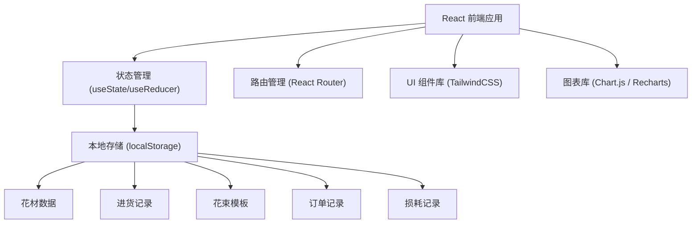
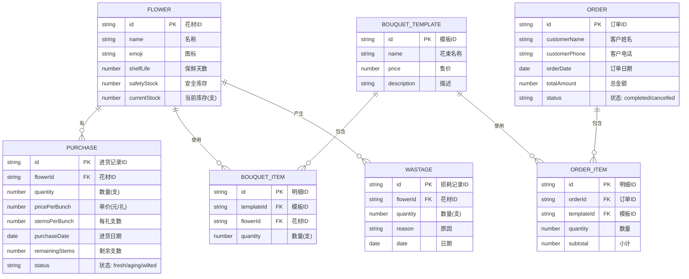

## 1. 架构设计



## 2. 技术描述

- **前端框架**：React 18 + TypeScript
- **构建工具**：Vite 5
- **样式方案**：TailwindCSS 3
- **路由管理**：React Router v6
- **图表库**：Recharts
- **状态管理**：React Hooks (useState + useContext)，无需 Redux
- **数据持久化**：localStorage（纯前端，无需后端）
- **图标**：Lucide React
- **日期处理**：date-fns

## 3. 路由定义

| 路由 | 页面 | 说明 |
|------|------|------|
| `/` | 库存总览 | 首页，展示库存、花期提醒、快捷操作 |
| `/purchase` | 进货管理 | 进货列表 + 新增进货 |
| `/templates` | 花束模板 | 模板列表 + 新增/编辑模板 |
| `/orders` | 订单销售 | 订单列表 + 新建订单 |
| `/stats` | 月度统计 | 销量、损耗、销售概览 |

## 4. 数据模型

### 4.1 数据模型 ER 图



### 4.2 数据结构定义

```typescript
// 花材类型
interface Flower {
  id: string;
  name: string;
  emoji: string;
  shelfLife: number;      // 保鲜天数
  safetyStock: number;    // 安全库存(支)
  currentStock: number;   // 当前库存(支)
}

// 进货记录
interface Purchase {
  id: string;
  flowerId: string;
  quantity: number;       // 进货数量(支)
  pricePerBunch: number;  // 每扎价格
  stemsPerBunch: number;  // 每扎支数
  purchaseDate: string;   // 进货日期 YYYY-MM-DD
  remainingStems: number; // 剩余支数
}

// 花束模板明细
interface BouquetItem {
  flowerId: string;
  quantity: number;
}

// 花束模板
interface BouquetTemplate {
  id: string;
  name: string;
  price: number;
  description: string;
  items: BouquetItem[];
}

// 订单项
interface OrderItem {
  templateId: string;
  templateName: string;
  quantity: number;
  subtotal: number;
  flowerUsage: { flowerId: string; flowerName: string; quantity: number }[];
}

// 订单
interface Order {
  id: string;
  customerName: string;
  customerPhone: string;
  orderDate: string;
  totalAmount: number;
  items: OrderItem[];
  status: 'completed' | 'cancelled';
}

// 损耗记录
interface Wastage {
  id: string;
  flowerId: string;
  flowerName: string;
  quantity: number;
  reason: string;
  date: string;
}
```

### 4.3 初始数据

系统初始化时内置 4 种花材：

| 花材 | 图标 | 保鲜期 | 安全库存 |
|------|------|--------|----------|
| 红玫瑰 | 🌹 | 7 天 | 30 支 |
| 百合 | 🌸 | 10 天 | 20 支 |
| 满天星 | 🌼 | 14 天 | 50 支 |
| 康乃馨 | 🌷 | 12 天 | 30 支 |

内置花束模板示例：
- 99朵红玫瑰（99支红玫瑰）
- 温馨百合束（11支百合 + 5支满天星）
- 康乃馨祝福（33支康乃馨 + 8支满天星）
- 混搭花束（19支玫瑰 + 5支百合 + 10支满天星）

## 5. 核心功能实现要点

### 5.1 库存管理
- 库存按花材维度汇总（从所有进货批次的 remainingStems 求和）
- 扣减库存时遵循「先进先出」原则，先扣最早进货的批次
- 库存低于安全库存时显示红色预警

### 5.2 花期计算
- 每个进货批次单独计算剩余保鲜天数
- 剩余天数 = 保鲜期 - (今天 - 进货日期)
- 剩余 ≤ 2 天标红预警，≤ 3 天标黄提醒
- 可手动标记某批次为「报损」或「特价」

### 5.3 订单流程
1. 选择花束模板和数量
2. 计算所需每种花材的总数量
3. 校验库存是否充足
4. 确认后扣减库存（先进先出），创建订单记录
5. 支持撤销订单（恢复库存）

### 5.4 月度统计
- 销量统计：按花材汇总当月订单中使用的数量
- 损耗统计：按花材汇总当月报损数量和金额
- 销售概览：总销售额、订单数、平均客单价

## 6. 项目目录结构

```
src/
├── components/          # 通用组件
│   ├── Layout/         # 布局组件（侧边栏、顶部导航）
│   ├── FlowerCard/     # 花材卡片
│   ├── Modal/          # 弹窗组件
│   └── StatCard/       # 统计卡片
├── pages/              # 页面组件
│   ├── Dashboard/      # 库存总览
│   ├── Purchase/       # 进货管理
│   ├── Templates/      # 花束模板
│   ├── Orders/         # 订单销售
│   └── Stats/          # 月度统计
├── hooks/              # 自定义 Hooks
│   ├── useFlowers.ts   # 花材管理
│   ├── usePurchase.ts  # 进货管理
│   ├── useTemplates.ts # 模板管理
│   ├── useOrders.ts    # 订单管理
│   └── useStats.ts     # 统计计算
├── types/              # TypeScript 类型定义
│   └── index.ts
├── utils/              # 工具函数
│   ├── storage.ts      # localStorage 封装
│   ├── date.ts         # 日期处理
│   └── helpers.ts      # 通用工具
├── data/               # 初始数据
│   └── seedData.ts
├── App.tsx
├── main.tsx
└── index.css
```
